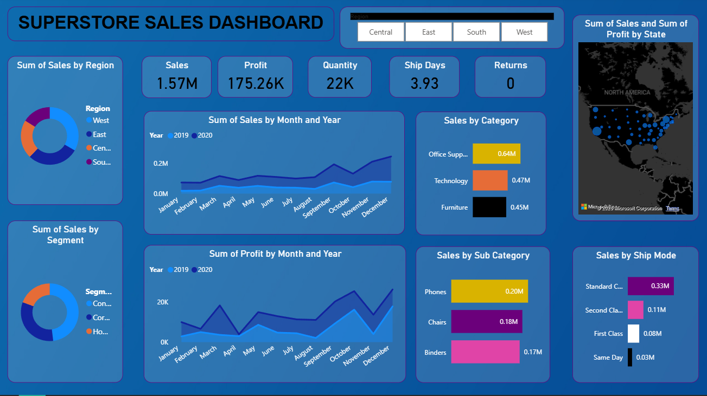

# Superstore Sales Dashboard (Power BI)

## Project Overview
This project presents an interactive Power BI dashboard built using the Superstore dataset to analyze sales performance, profit trends, and customer segments.

The dashboard helps businesses understand revenue patterns, shipping performance, and product category contributions.

## Dashboard Features

• Total Sales KPI: 1.57M  
• Total Profit KPI: 175.26K  
• Quantity Sold: 22K  
• Average Shipping Days: 3.93  

### Visual Insights
- Sales distribution by Region
- Monthly sales trend comparison (2019 vs 2020)
- Profit analysis over time
- Sales breakdown by Category and Sub-Category
- Shipping mode analysis
- Geographic sales distribution by State

## Tools & Technologies

Power BI  
Data Visualization  
Data Analysis  
Dataset: Superstore Dataset

## Key Insights

• Technology category generates high sales revenue.  
• Standard Class is the most used shipping mode.  
• Sales increased significantly in the last quarter.  
• Western and Eastern regions contribute the most sales.

## Dashboard Preview

## Author

Rudresh Pratap Singh
Aspiring Data Scientist | Data Analyst
